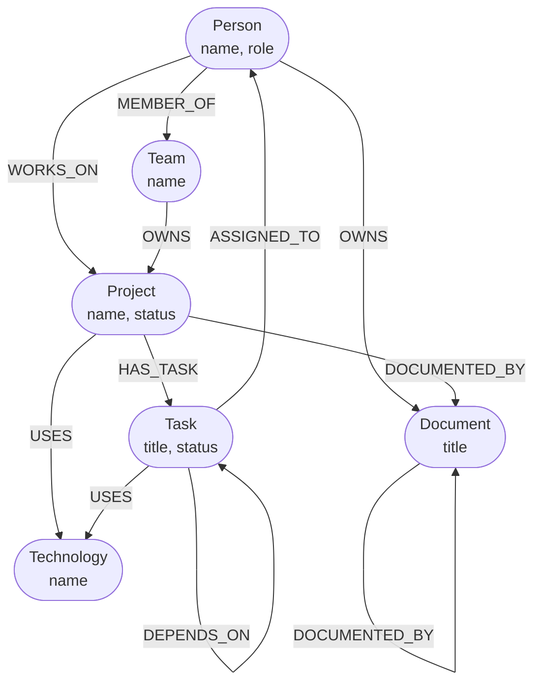

# WorkGraph

## What my application does
**WorkGraph** is a full-stack web application backed by **CognoDB** (a managed graph database supporting openCypher) that visualizes an organization's internal structure. It maps people, teams, projects, tasks, technologies, and documents to help users navigate complex dependencies that traditional organizational charts miss.

## Why i chose this problem
Modern organizations suffer from siloed information. Standard HR tools show reporting lines (who reports to whom), but they fail to capture the *actual* work structure: who is working on what project, what technologies that project uses, and which documents specify its requirements. WorkGraph was born out of the necessity to make cross-functional context readily available and highly searchable. By turning the organization into a graph, we empower employees to discover shared dependencies, locate experts, and see how their tasks tie into the broader company goals.

## Why a graph database makes sense
Organisational data is inherently a network of relationships. In a relational database (SQL), modeling "Who is working on the project that depends on the task blocked by the team using React?" requires brittle, complex `JOIN` operations across multiple junction tables (`ProjectTeam`, `TeamMember`, `TaskDependency`, etc.). 

A graph database is the perfect fit for this use case because:
1. **Relationships are First-Class Citizens**: We can natively traverse paths like `(Person)-[:WORKS_ON]->(Project)-[:USES]->(Technology)`.
2. **Variable-Depth Traversals**: Some queries, such as "Find all blocking dependencies up to N levels deep," require recursive CTEs in SQL which are slow and hard to maintain. Cypher solves this trivially with `[:DEPENDS_ON*1..5]`.
3. **Shortest Paths**: Discovering how any two isolated employees or projects are connected (e.g., to find an introduction or shared context) is a natural graph traversal that is computationally expensive in traditional RDBMS environments.

## Graph Data Model
Our data model captures the reality of a modern workplace by establishing clear Nodes, Relationships, and Properties.

### Node Types
- **Person**: Represents an employee or contractor.
- **Team**: Represents a group of people.
- **Project**: A high-level initiative.
- **Task**: An actionable unit of work.
- **Technology**: Tools, frameworks, or languages.
- **Document**: Specifications, guides, or RFCs.

### Relationship Types
- `MEMBER_OF`: Links Person to Team.
- `WORKS_ON`: Links Person to Project.
- `OWNS`: Links Team to Project, or Person to Document.
- `HAS_TASK`: Links Project to Task.
- `USES`: Links Project/Task to Technology.
- `DEPENDS_ON`: Links Task to another Task (blockers).
- `ASSIGNED_TO`: Links Task to Person.
- `DOCUMENTED_BY`: Links Project/Document to Document.

### Properties
Every node contains basic properties like `id` and `name` (or `title`). Additional properties include:
- **Person**: `role`
- **Project**: `status`
- **Task**: `status`

### Data Model Diagram


## Main Cypher queries and what they do

All queries are parameterized via the Neo4j JavaScript Driver to prevent injection. 

### 1. Multi-Hop Variable-Depth Traversal
**What it does:** Recursively traverses the `DEPENDS_ON` relationship to find a chain of blocking tasks up to a depth of 5. Useful for finding root blockers for a given task.
```cypher
MATCH path = (t:Task {id: $id})-[:DEPENDS_ON*1..5]-(blocker:Task)
RETURN DISTINCT blocker, labels(blocker) AS types
```

### 2. Complex Cross-Team Context
**What it does:** Finds all individuals that belong to a team that owns a specific project. This multi-hop traversal natively surfaces cross-functional boundaries.
```cypher
MATCH (proj:Project {id: $id})<-[:OWNS]-(team:Team)<-[:MEMBER_OF]-(person:Person)
RETURN DISTINCT person, labels(person) AS types
```

### 3. Shortest Path Algorithm
**What it does:** Calculates the shortest sequence of relationships connecting any two items in the organization (up to 10 hops). Useful for discovering mutual context or introductions between two isolated employees.
```cypher
MATCH (a {id: $from}), (b {id: $to}),
      path = shortestPath((a)-[*..10]-(b))
RETURN nodes(path) AS nodes, relationships(path) AS rels
```

## How to create/configure the CognoDB instance
1. Sign up/log in to [console.cognodb.com](https://console.cognodb.com/).
2. Create a free (c0) instance.
3. Wait for the instance to provision.
4. Once provisioned, locate your connection credentials under the settings tab. You will need the `bolt+s://` URI and the generated password for the `cognodb` user.

## How to run the project locally

### Prerequisites
- Node.js (v16+)
- CognoDB Cloud connection details

### Backend Setup & Data Seeding
1. Open a terminal and navigate to the `backend` directory:
   ```bash
   cd backend
   npm install
   ```
2. Copy `.env.example` to `.env` and fill in your CognoDB connection details:
   ```env
   NEO4J_URI=bolt+s://<instance-id>.databases.cognodb.cloud
   NEO4J_USER=cognodb
   NEO4J_PASSWORD=<your-generated-password>
   PORT=3001
   ```
3. **Seed the database** with dummy organizational data:
   ```bash
   npm run seed
   ```
4. Start the backend DEV server:
   ```bash
   npm run dev
   ```

### Frontend Setup
1. Open a new terminal and navigate to the `frontend` directory:
   ```bash
   cd frontend
   npm install
   ```
2. Start the Vite development server:
   ```bash
   npm run dev
   ```
3. Open `http://localhost:5173` in your browser.
